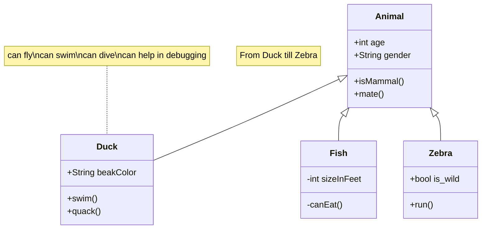

# Scripts de Unity
Repositorio de Scripts utilizados en la clases de Unity

## Script RestarVida 😮

Este Script fue creado para poder restarle vida a un objeto y que se destruya, teniendo en cuanta la colision con OnTriggerEnter. 

Pasos para implementar el Script RestarVida
- Every tutorial is built against the same [API spec](api/) to ensure modularity of every frontend & backend
- Every frontend utilizes the same handcrafted for identical UI/UX
- There is a hosted version of the backend API available for public usage, no API keys are required
- Interested in creating a new RealWorld stack? 

**RealWorld** solves this by allowing you to choose any frontend (React, Angular, & more) and any backend (Node, Django, & more) and see how they power a real-world, beautifully designed full-stack app called

## Script CambiaDireccion 

Este Script fue creado para poder cambiar la direccion de movimiento de un objeto cuando colisione con otro mediante la colision con OnTriggerEnter. 

## Script ManagerEscena  

Este Script fue creado para poder cargar otra escena mediante un boton que se encuentra dentro de un canvas. [Ver Codigo](ManagerEscenas.cs) 

## Script SonidoPickup

SonidoPick nos permite integrar un sonido cuando colisione con otro objeto y asi poder emular agarrar cosas como (pociones, monedas, etc..) para usar este script debemos primero crear una variable publica tipo AudioClip que es la que nos va a permitir agregar el sonido en el unity, tambien tener en cuenta que debemos colocarle un componente AudioSource al objeto que asignemos este script. [Ver Codigo](SonidoPickup.cs) 

